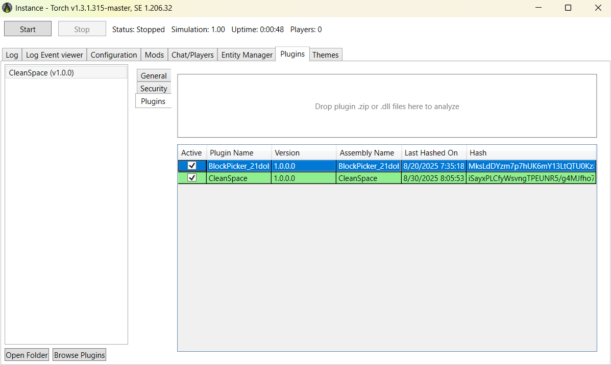
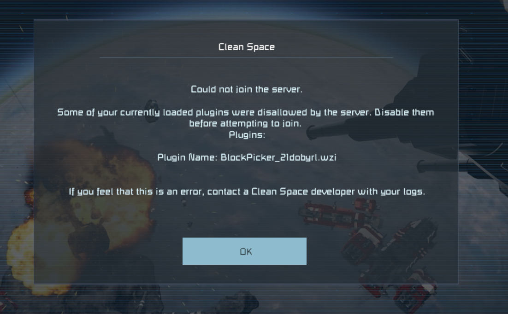
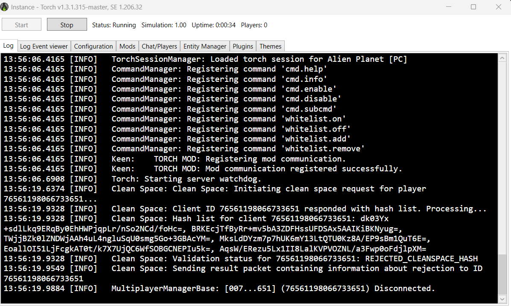
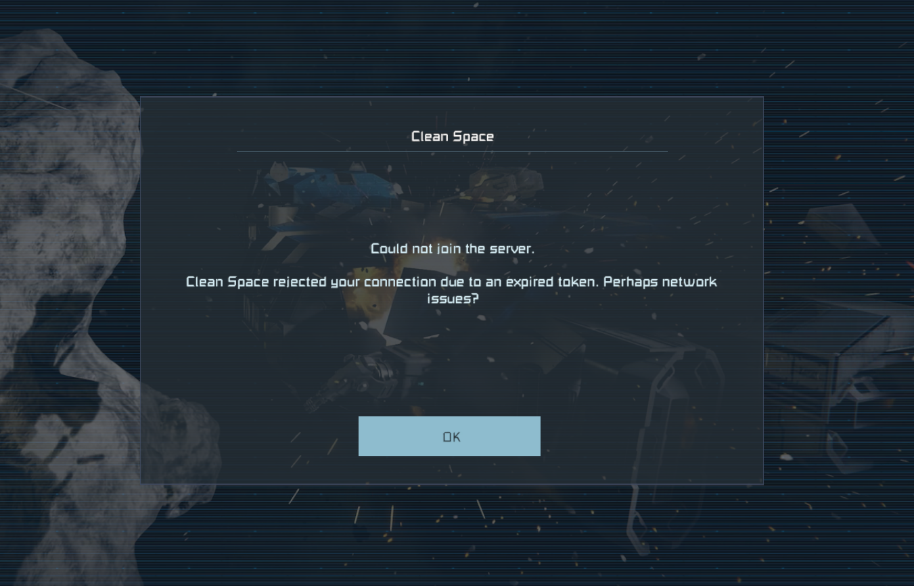

# Clean Space: A better space engineers multiplayer experience.

Space engineers is a game with limitless potential, and for every constraint on a player there is always a way around it. 
That's great! Until the way the game is played affects others. One of the ways this can happen is through client side plugins
that provide their user with an unfair advantage. While these plugins are not officially supported by keen and are often
banned by the communities they are used in; there is no real way to enforce these bans.  

Clean space changes that.  

## What is Clean Space?

Clean space is a client and server plugin for Space Engineers designed to allow server owners to whitelist or blacklist plugins that clients can connect with. It supports dedicated servers using Torch API to manage their instance.

## What does it do?

On the client side, Clean Space identifies plugins by reading the assemblies referenced by Space Engineers in it's memory space while running. 
By fingerprinting the internal structure of plugins, Clean Space uniquely identifies each assembly detected as a plugin and generates a signature for it.
A list of these signatures is sent to a server upon requesting a Clean Space from the client.

On the server side, Clean Space sits inbetween players attempting to connect to your server and adds an extra step to the process. During initial connection,
Clean Space will ask the player's client for a list of signatures detected running within Space Engineer's memory space. It will compare the signatures provided by the client to
a list of signatures maintained by the server's Clean Space plugin. Depending on how it is set up, Clean Space can then deny, allow, or log information about clients before the session is accepted and the world begins to load.

## Does Clean Space look on my hard drive?

No. Clean Space operates only within Space Engineer's memory region while running. It does not scan for plugins in the filesystem where it is installed.

## Do clients have to use the plugin?

It depends. If you set up Clean Space to deny connections on match, then all of your clients will need the client side Clean Space plugin to connect. If they do not have clean space,
then it will cancel their connection and display a 'Ticket Invalid' prompt on an attempted join. If you have Clean Space set up to allow clients regardless of matches, then Clean Space does not care whether or not a client has plugins, and will allow them regardless. 

## What's stopping me from <X>?

The code is open source, and if you feel like you can circumvent it you are welcome to try. If you manage to, please do share how ;). Otherwise, forging any part of a Clean Space
request is difficult.  
  
The information exchanged is given an additional layer of AES-CBC encryption and validation, and each message uses time-sensitive HMAC encrypted tokens to help defend against replay attacks and maniuplation. 
The signatures for plugins are generated based on their internal structure and have been strengthened against precomputation. Any manipulation of how Clean Space works will change the way clean space communicates with the server, and Clean Space will identify this.

## What's the catch?

Once again, your players will **HAVE** to install Pulsar/Plugin Loader in order to use the client side plugin. It is not a mod.  
See: github.com/StarCpt/Pulsar-Installer 

## Warnings:

This plugin is in development and is currently in a proof-of-concept stage. If you try to run it on your very popular server right now you will be very big trouble. 
Feel free to give it a spin on a private instance.