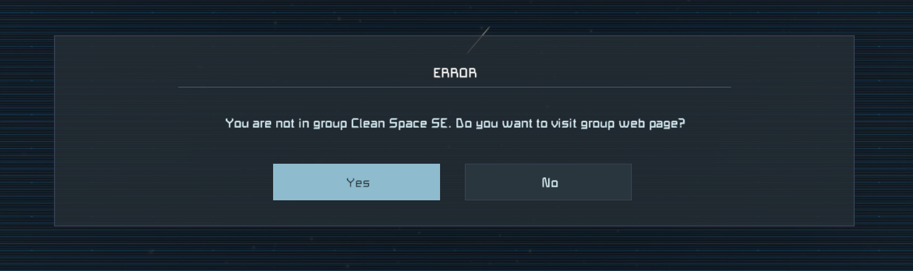
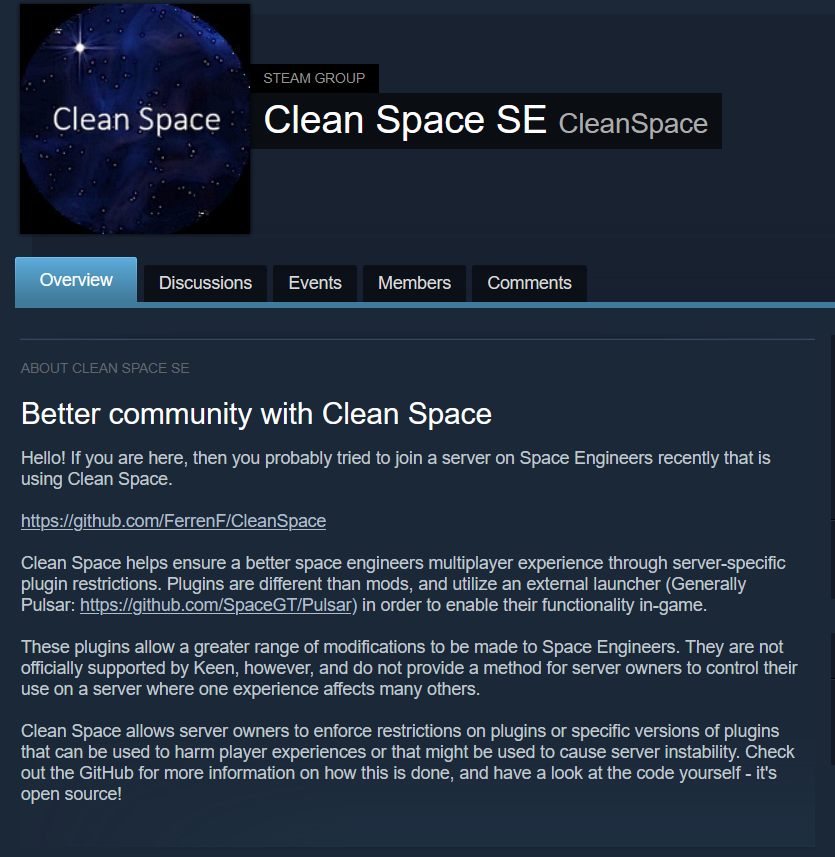

# Clean Space: A cleaner Space Engineers multiplayer experience.

Space engineers is a game with limitless potential, and for perceived limitation on a player there is always ten different unorthodox ways around it. Keen has
provided us with a massive sandbox to modify as we se fit with *mods* and the community has built a city on it.  

Another form of modification to the game that Keen is a tad less 'keen' on is *Plugins*. These modifications to the game exist outside of Keen and Steam's ultimate control and have been a source controversy on multiplayer servers since the days people have had something to lose. (always)
  
Plugins are assembly files that operate at the same language level and with the same operating system permissions as the game - giving them a near limitless amount of power and potential in the
context of modifying Space Engineers. This power comes with a catch; bad actors can use this extensibility as a doorway to distribute malicious software, or even a less technically savy user can easily install
plugins that affect the way their game functions on a multiplayer server. 

The open nature of the game tends to attract a very intelligent community full of energy for bringing their creations to life - and that energy tends to stop for no barrier.
"By any means" could be the motto of the Space Engineers community. If an advantage exists, the community will use it. It's the nature of the game!

That is, until the way the game is played for one affects others in an unfair way. In most cases, it means a more negative experience for the party that does not use an advantage. That advantage in
this case are plugins. Consider two ships engaging in combat where one pilot can see through the ship and has it's critical components highlighted on their HUD? While this is an easy to imagine example, the possibilities are once again; truly unlimited.  

While these plugins are not officially supported by keen and are often banned by the communities they are found used in; there is no real way to enforce these bans. Most servers rely on policy and community culture in order to convince players not to engage in the use
of unfair plugins. 

Clean space changes that.  

## What is Clean Space?

Clean space is a client and server plugin for Space Engineers designed to allow server owners to whitelist or blacklist plugins that clients can connect with. It supports dedicated servers using Torch API to manage their instance.

## What does it do?

On the client side, Clean Space identifies plugins by reading the assemblies referenced by Space Engineers in it's memory space while running. 
By fingerprinting the internal structure of plugins, Clean Space uniquely identifies each assembly detected as a plugin and generates a signature for it.
A list of these signatures is sent to a server upon requesting a Clean Space from the client.

On the server side, Clean Space sits inbetween players attempting to connect to your server and adds an extra step to the process. During initial connection,
Clean Space will ask the player's client for a list of signatures detected running within Space Engineer's memory space. It will compare the signatures provided by the client to
a list of signatures maintained by the server's Clean Space plugin. Depending on how it is set up, Clean Space can then deny, allow, or log information about clients before the session is accepted and the world begins to load.

## Does Clean Space look on my hard drive?

No. Clean Space operates only within Space Engineer's memory region while running. It does not scan for plugins in the filesystem where it is installed.

## Do clients have to use the plugin?

It depends. If you set up Clean Space to deny connections on match, then all of your players will need the client-side Clean Space plugin to connect.
If they do not have clean space, then they will be disconnected and then directed to a steam group information page including information about Clean Space and where to get it.

## What's stopping me from ...X?

The code is open source, and if you feel like you can circumvent it you are welcome to try. If you manage to, please do share how ;). Otherwise, forging any part of a Clean Space
request is difficult.  
  
The information exchanged is given an additional layer of AES-CBC encryption and validation, and each message uses time-sensitive HMAC encrypted tokens to help defend against replay attacks and maniuplation. 
The signatures for plugins are generated based on their internal structure and have been strengthened against precomputation. Any manipulation of how Clean Space works will change the way clean space communicates with the server, and Clean Space will identify this.

## What's the catch?

Once again, your players will **HAVE** to install Pulsar/Plugin Loader in order to use the client side plugin. It is not a mod.  
See: github.com/StarCpt/Pulsar-Installer 

## Warnings:

This plugin is in development and is currently in a proof-of-concept stage. If you try to run it on your very popular server right now you will be very big trouble. 
Feel free to give it a spin on a private instance.